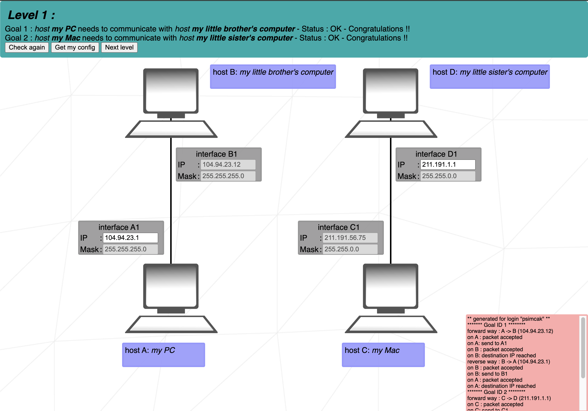

# Level 1 - Understanding IP addresses

IP addresses consist of four octets in the format **XXX.XXX.XXX.XXX**. Each octet represents an 8-bit number, ranging from **0** to **255** in decimal, or **0000 0000** to **1111 1111** in binary.

Subnet **Masks** determine how many bits of an IP address are reserved for the network and how many are available for hosts. For example:

- With a **255.255.255.0** subnet mask, the first three octets (24 bits) are reserved for the network, and the last octet (8 bits) can be used for assigning hosts within the network (up to 254 possible addresses).
- With a **255.255.0.0** subnet mask, the first two octets (16 bits) are reserved for the network, and the remaining two octets (16 bits) can be used for hosts (up to 65,534 possible addresses).

For the given IP addresses (**B1** and **C1**), the changes to **A1** and **D1** must only occur in the bits that are not reserved by the subnet mask. That means:

- For **A1**, only the last octet can be modified (since **255.255.255.0** leaves the last 8 bits for host addresses).
	- A1's IP address must match B1’s IP address in the first three octets, but the last octet (the final number) must be different. For example, if B1's IP address is **104.94.23.12**, A1 could be **104.94.23.2**.

- For **D1**, the last two octets can be modified (since **255.255.0.0** leaves the last 16 bits for host addresses).
	- D1's IP address must match C1’s IP address in the first two octets, but the last two octets must be different. For example, if C1's IP address is **211.191.56.75**, D1 could be **211.191.2.2**.

## Network and Broadcast Addresses
- The **broadcast address** is the last address in the IP range for a given subnet. It is used to send messages to **all devices** on the network simultaneously. When a device sends a message to the broadcast address, all devices in the subnet receive the message.

- In IP addressing, addresses ending in `.0` and `.255` should not be assigned to individual hosts within a subnet.

- An address ending in `.0` typically represents the **network address**, which identifies the entire network, while an address ending in `.255` is reserved as the **broadcast address**, used to communicate with all devices on the network.

- For subnets like `255.255.255.0`, the usable range for assigning to devices falls between `.1` and `.254`.

- The **network address** is the first address in a given IP subnet, and it is used to identify the specific network segment. It represents the entire network itself, not any individual device on the network. This address is calculated by taking the IP address and applying the subnet mask, which determines how many bits are reserved for the network.