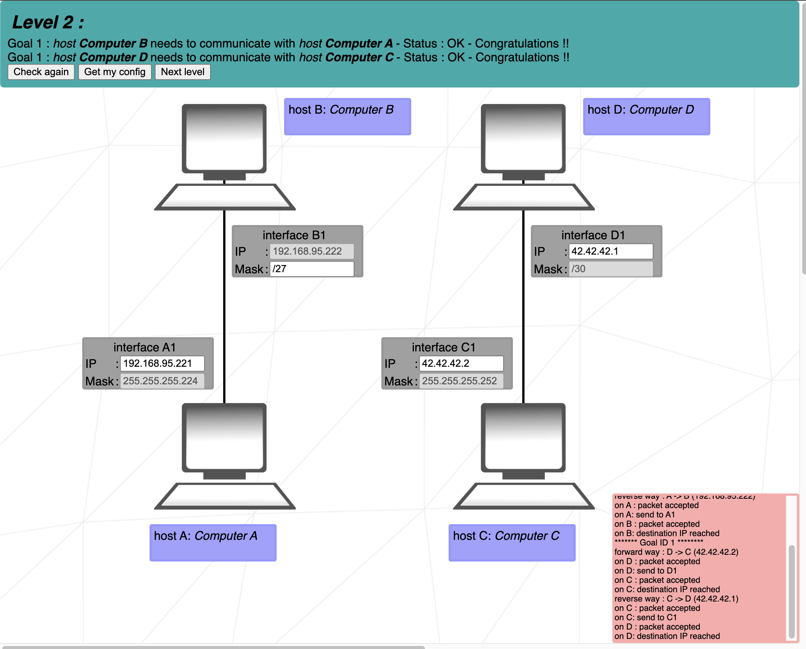

# Level 2
### Blocked addresses
- as described in the main README.md, some of the IP addresses are block. In this case, there was a **127.X.X.X** adress in **D1** and **C1**. We changed it for free/available adress **42.42.42.X**.

### CIDR / Group size
- Main task of this exercise is to choose correctly IP addresses.
1. Look at the Mask
2. Find the matching 'Group size'
3. Set the range where we operate (smallest 'Network ID' - largest 'Network ID')
	- if there is one IP set up, you have to operate in pre-set range
	- if both IP addresses are free to edit, choose which **subnet** we want to use
4. Write any number in this range

### Mask
- Mask for **B1** is easy to set because it must be the same like with the one in **A1**.
- small level up is that instead of writing **255.255.255.224** we write simply **/27**. Its the same and its faster to write down.
	- 27 represents in this case a number of bits that are set to **1** out of the four-octet.
	- with the cheat sheet we simply see what subnet number belongs to which CIDR number

## Cheat scheet
|Group size|Subnet|CIDR|3rd Octet|2nd Octet|1st Octet|
|    -     |   -  |  - |    -    |    -    |    -    |
|   128    |  128 | \25|   \17   |   \9    |   \1    |
|    64    |  192 | \26|   \18   |   \10   |   \2    |
|    32    |  224 | \27|   \19   |   \11   |   \3    |
|    16    |  240 | \28|   \20   |   \12   |   \4    |
|    8     |  248 | \29|   \21   |   \13   |   \5    |
|    4     |  252 | \30|   \22   |   \14   |   \6    |
|    2     |  254 | \31|   \23   |   \15   |   \7    |
|    1     |  255 | \32|   \24   |   \16   |   \8    |
