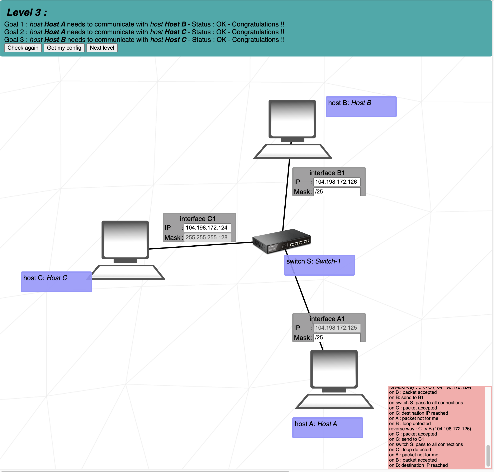

# Level 3
### Step by step
1. We have fix Mask in **C1** -> set the same Mask in **B1** and **A1**
2. Look to the cheat scheet and find the /25 CIDR value (128). That effect the last octet.
3. We have one IP fixly setted up (**104.198.172.125**)
4. Set the range of lowest usable Network ID and highest usable Network ID (**104.198.172.1** - **104.198.172.126**)
	- if this does not make sense, look to the resources and watch the YT videos
5. Choose any addresses for **C1** and **B1** in this range

## Cheat scheet
|Group size|Subnet|CIDR|3rd Octet|2nd Octet|1st Octet|
|    -     |   -  |  - |    -    |    -    |    -    |
|   128    |  128 | \25|   \17   |   \9    |   \1    |
|    64    |  192 | \26|   \18   |   \10   |   \2    |
|    32    |  224 | \27|   \19   |   \11   |   \3    |
|    16    |  240 | \28|   \20   |   \12   |   \4    |
|    8     |  248 | \29|   \21   |   \13   |   \5    |
|    4     |  252 | \30|   \22   |   \14   |   \6    |
|    2     |  254 | \31|   \23   |   \15   |   \7    |
|    1     |  255 | \32|   \24   |   \16   |   \8    |
