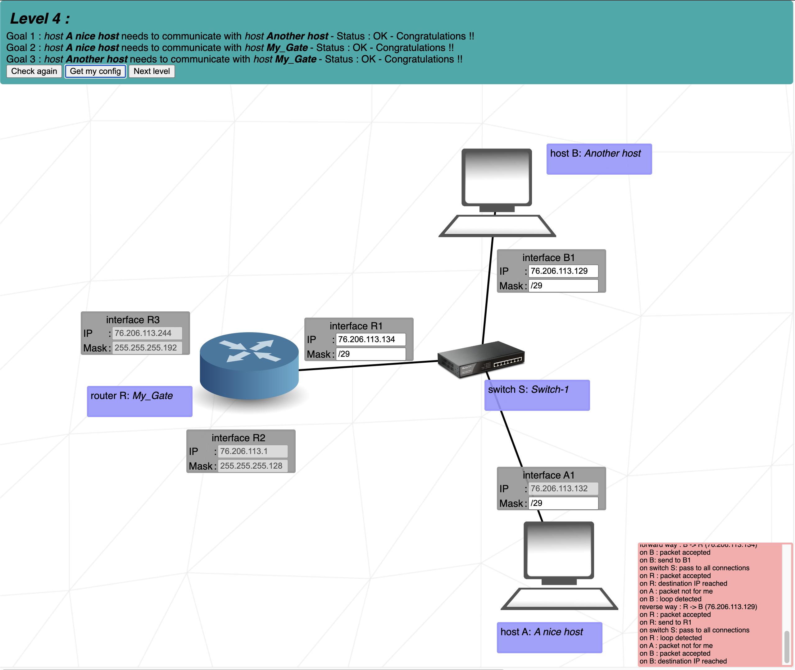

# Level 4
### Step by step
1. We can set the Mask value for all comunicating components 
	- How many devices will comunicate in the subnetwork? = three. 
	- Look at the 'Cheat sheet' and how big must be the 'Grou size'? = eight (4 is too little because we work with old infrastructure where is lowest and highest Host IPs of the subnetwork reserved for **Network ID** and **Broadcast IP** - aka the /30 is too low and /28 is unnecessary high)
2. From **A1** we have the IP setted up to **76.206.113.132**
	- What are the first and last Host IPs of our subnet? = **76.206.113.129** and **76.206.113.134**
	- (We can use any address in that range but I chose the edge cases)

## Cheat scheet
|Group size|Subnet|CIDR|3rd Octet|2nd Octet|1st Octet|
|    -     |   -  |  - |    -    |    -    |    -    |
|   128    |  128 | /25|   /17   |   /9    |   /1    |
|    64    |  192 | /26|   /18   |   /10   |   /2    |
|    32    |  224 | /27|   /19   |   /11   |   /3    |
|    16    |  240 | /28|   /20   |   /12   |   /4    |
|    8     |  248 | /29|   /21   |   /13   |   /5    |
|    4     |  252 | /30|   /22   |   /14   |   /6    |
|    2     |  254 | /31|   /23   |   /15   |   /7    |
|    1     |  255 | /32|   /24   |   /16   |   /8    |
