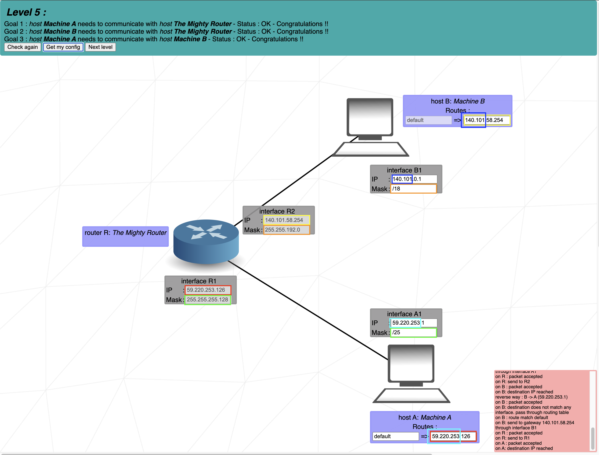

# Level 5
### Step by step
1. **host A** and **host B** contain two fields, the first one is the ***destination of outbound packets***, the second one is the ***next hop of the packets***.
	- The ***default*** entry means that for any packet whose destination cannot be matched with a specific route, the packet will be forwarded to the specified ***next hop IP address*** (**59.220.253.126**), which is the IP address of **Router R** (The Mighty Router) interface **R1**.
	- This means that **Host A** will send any packet (for which it has no specific route) to **Router R**, which will then decide where to forward it based on its routing table.

## Cheat scheet
|Group size|Subnet|CIDR|3rd Octet|2nd Octet|1st Octet|
|    -     |   -  |  - |    -    |    -    |    -    |
|   128    |  128 | /25|   /17   |   /9    |   /1    |
|    64    |  192 | /26|   /18   |   /10   |   /2    |
|    32    |  224 | /27|   /19   |   /11   |   /3    |
|    16    |  240 | /28|   /20   |   /12   |   /4    |
|    8     |  248 | /29|   /21   |   /13   |   /5    |
|    4     |  252 | /30|   /22   |   /14   |   /6    |
|    2     |  254 | /31|   /23   |   /15   |   /7    |
|    1     |  255 | /32|   /24   |   /16   |   /8    |
