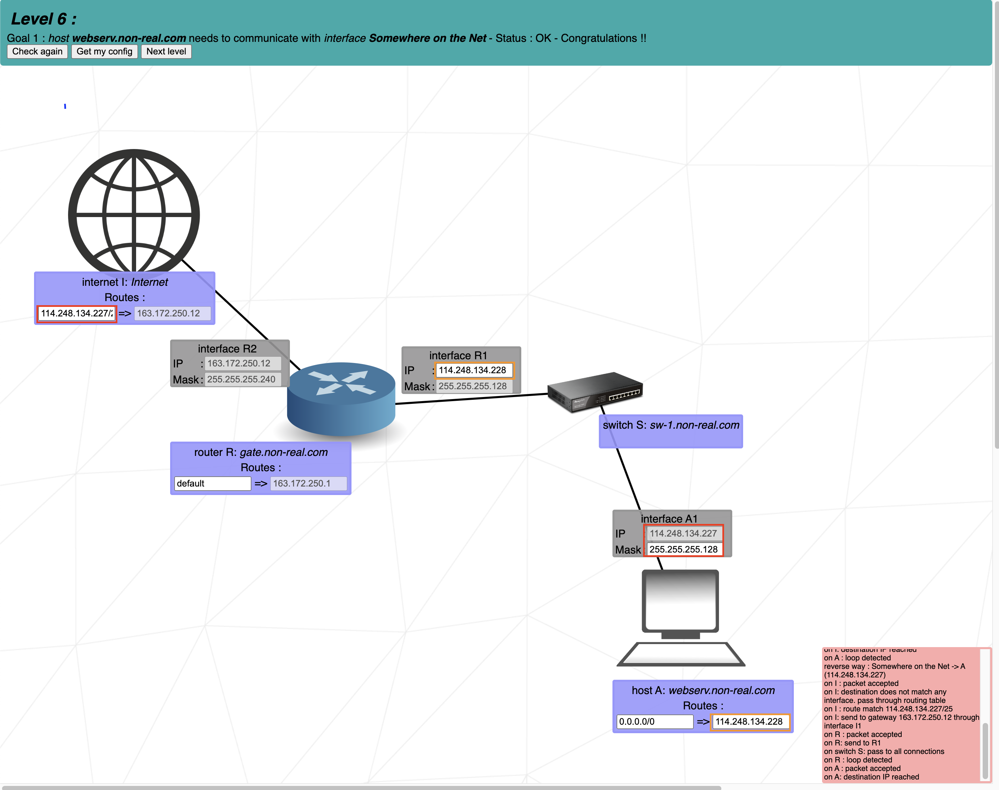

# Level 6
This level introduces the **internet**. The internet behaves like a router. However, if an interface is connected directly or indirectly to the internet, it **cannot** have an IP address in the following reserved private IP ranges:

```
192.168.0.0 - 192.168.255.255 (65,536 IP addresses)
172.16.0.0 - 172.31.255.255   (1,048,576 IP addresses)
10.0.0.0 - 10.255.255.255     (16,777,216 IP addresses)
```

**1.** The **next hop** of the internet is already entered, and matches the IP address of the _Interface R2_. Therefore we only need to bother with the destination of the internet.
<br>
<br>
The internet must send its packets to _Client A_. To do so, the internet's destination must match the network address of _Client A_. Let's find the network address of _Client A_:
<br>
_Client A_'s mask is _255.255.255.128_, which is equivalent to _/25_. This means that the first 25 bits of its IP address are its network address. We know then that the first 3 bytes (24 bits) of its IP address make part of its network address:

  <center>

```
40.178.145.?
```

  </center>

We now only need to find out if the 25th bit is a 1 or a 0.
<br>
If we convert the number 227 to binary, we get `11100011`. The first digit, which corresponds to the 25th bit, is a 1. Since only the 25th bit is part of the network address and not the remaining 7 bits, we get `10000000` for the last byte of the network address, which is 128 in decimal.
<br>
<br>
The full network address is:

  <center>

```
40.178.145.128
```

  </center>

With a range of _40.178.145.129 - 40.178.145.254_ for its host addresses.
<br>
<br>
We can now put this address of **40.178.145.128** in the Internet destination. The **/25** following the destination address represents the mask applied to its address.
<br>
<br>
A destination of _40.178.145.227/25_ is equivalent to the destination address _40.178.145.128/25_, since the mask of _/25_ will turn all the bits after the 25th to 0 to get the destination's network address.


## Cheat scheet
|Group size|Subnet|CIDR|3rd Octet|2nd Octet|1st Octet|
|    -     |   -  |  - |    -    |    -    |    -    |
|   128    |  128 | /25|   /17   |   /9    |   /1    |
|    64    |  192 | /26|   /18   |   /10   |   /2    |
|    32    |  224 | /27|   /19   |   /11   |   /3    |
|    16    |  240 | /28|   /20   |   /12   |   /4    |
|    8     |  248 | /29|   /21   |   /13   |   /5    |
|    4     |  252 | /30|   /22   |   /14   |   /6    |
|    2     |  254 | /31|   /23   |   /15   |   /7    |
|    1     |  255 | /32|   /24   |   /16   |   /8    |
