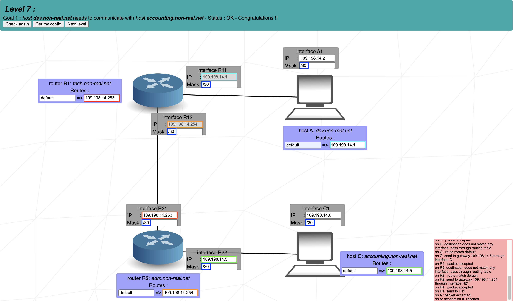

# Level 7
### Step by step
1. How many devices will be in one subnet and how many subnets we have? = both are two -> /30 mask is enought for all of them
2. **R12** has set up IP = `109.198.14.254`. The last oktet range of Host IPs = `.253` - `.254`. Use the `.253` for **R21**.
3. **R11** has set up IP as well = `109.198.14.1`. Same logic, we have `.1` and `.2` (for **A1**)
4. **R22** and **C1** is up to set so we chose lowest adresses available: `.5` (**R22**) and `.6` (**C1**)
5. Lastly set up the Routes to take any package and send it to the correct destination.

## Cheat scheet
|Group size|Subnet|CIDR|3rd Octet|2nd Octet|1st Octet|
|    -     |   -  |  - |    -    |    -    |    -    |
|   128    |  128 | /25|   /17   |   /9    |   /1    |
|    64    |  192 | /26|   /18   |   /10   |   /2    |
|    32    |  224 | /27|   /19   |   /11   |   /3    |
|    16    |  240 | /28|   /20   |   /12   |   /4    |
|    8     |  248 | /29|   /21   |   /13   |   /5    |
|    4     |  252 | /30|   /22   |   /14   |   /6    |
|    2     |  254 | /31|   /23   |   /15   |   /7    |
|    1     |  255 | /32|   /24   |   /16   |   /8    |
