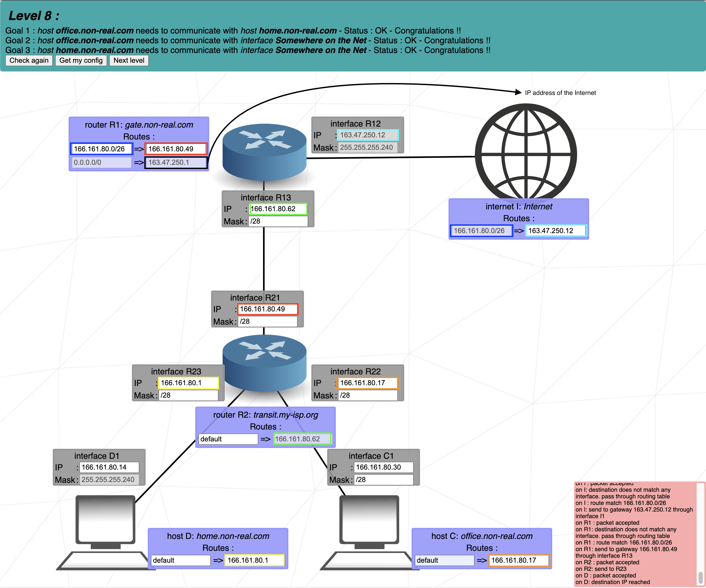

# Level 8
### Step by step
1. What is our preset mask? = /28 -> fill it elsewhere
2. router R2 has destination address. That is the IP of R13. That means that the communicating address: R21, has to be in the same Group size (don't forget to keep first and last address for broadcast and ID)
3. Set addresses for R22-C1 and R23-D1. Both have to be in separated Group. In this exercise I used the edge IP addresses.
4. Routes are sending packages in between specific destinations. In most cases we use default on input to check all addresses, but in two cases there are not default values. The Internet and router R1. Internet is prefilled and it tells us what is our IPv4 address with the mask to define what packages to send us and avoid sending all internet packages to everyone. R1 route tell us: from Internet, send packages to R21 AND second R1 route: from all addresses send local packages to the Internet.

## Cheat scheet
|Group size|Subnet|CIDR|3rd Octet|2nd Octet|1st Octet|
|    -     |   -  |  - |    -    |    -    |    -    |
|   128    |  128 | /25|   /17   |   /9    |   /1    |
|    64    |  192 | /26|   /18   |   /10   |   /2    |
|    32    |  224 | /27|   /19   |   /11   |   /3    |
|    16    |  240 | /28|   /20   |   /12   |   /4    |
|    8     |  248 | /29|   /21   |   /13   |   /5    |
|    4     |  252 | /30|   /22   |   /14   |   /6    |
|    2     |  254 | /31|   /23   |   /15   |   /7    |
|    1     |  255 | /32|   /24   |   /16   |   /8    |
