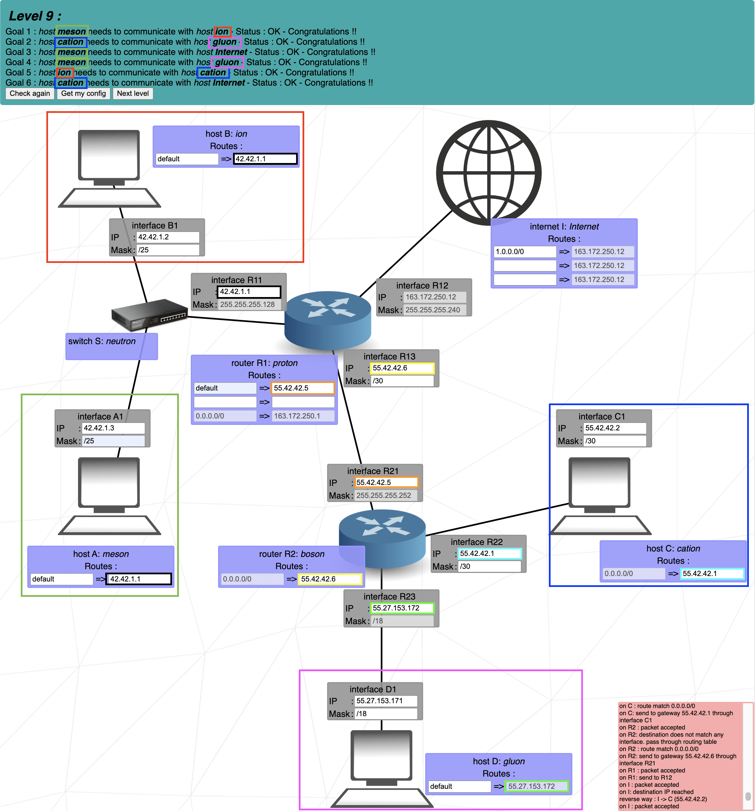

# Level 9
### Step by step
1. Find what we have prefilled: some masks and IPs -> fill the LANs accordingly
2. Undefinied IPs and masks can by set by us. Just keep in mind the general rules
3. The Internet is set to 1.0.0.0/0 = practically we say "reach any IPs". Its not how it works in real world - in json file we have more accurate values (aiming to the specific LANs)

I would suggest simply following the 6 goals of the level one by one until the level is completed. 

## Cheat scheet
|Group size|Subnet|CIDR|3rd Octet|2nd Octet|1st Octet|
|    -     |   -  |  - |    -    |    -    |    -    |
|   128    |  128 | /25|   /17   |   /9    |   /1    |
|    64    |  192 | /26|   /18   |   /10   |   /2    |
|    32    |  224 | /27|   /19   |   /11   |   /3    |
|    16    |  240 | /28|   /20   |   /12   |   /4    |
|    8     |  248 | /29|   /21   |   /13   |   /5    |
|    4     |  252 | /30|   /22   |   /14   |   /6    |
|    2     |  254 | /31|   /23   |   /15   |   /7    |
|    1     |  255 | /32|   /24   |   /16   |   /8    |
