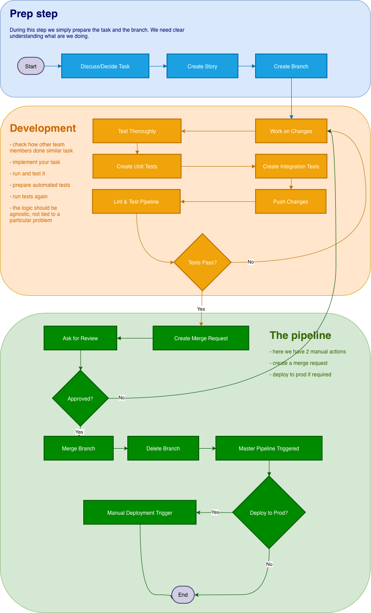

# Dev Workflow

---

## Table of Contents

1. [Prep Step](#1-prep-step)
2. [Development](#2-development)
3. [The Pipeline](#3-the-pipeline)

---

## 1. Prep Step

Before writing any code, align with the team on what needs to be done and why.

**Steps:**

1. **Discuss / Decide Task** — talk it through in standup or the issue thread. Make sure the scope is clear and not overlapping with someone else's work.
2. **Create Story** — open a GitLab issue. Add a description, acceptance criteria, and the relevant milestone. Assign yourself.
3. **Create Branch** — branch off `master` using the naming convention `<issue-number>-short-description` (e.g. `42-add-login-endpoint`).

> During this step we prepare the task and the branch. We need a clear understanding of what we're doing before touching code.

---

## 2. Development

Work happens on your feature branch. The goal is to deliver something tested and lint-clean before opening an MR.

**The goal is to have a short leaving branches. Ideally, you should be creating MRs as ofter and as soon as possible.**

**Steps:**

1. **Work on Changes** — implement the feature or fix on your branch.
2. **Create Integration Tests (optional for now)** — write tests that cover the interaction between your code and other services or the database.
3. **Create Unit Tests** — write unit tests for the logic you added.
4. **Test Thoroughly** — check how other team members have done similar tasks. Run everything locally.
   - Run docker compose locally.
   - If you have UI changes, open a browser, click through the app.
   - Check the developer console for errors.
   - If you have backend changes, see that requests are handled correctly and there are no errors.
   - Logic should be agnostic — not tied to a specific problem, reusable where possible
5. **Lint & Test Pipeline** — push your branch. The CI lint and test jobs run automatically.
6. **Tests Pass?**
   - **No** → fix the issues, push again, repeat from step 5.
   - **Yes** → proceed to The Pipeline.

---

## 3. The Pipeline

Once your branch is green, get it reviewed and merged.

**Steps:**

1. **Create Merge Request** — open an MR from your branch into `master`. Fill in the description: what changed, why, how to test it.
2. **Ask for Review** — assign a reviewer (Tech Lead is required for changes touching shared contracts: DB schema, inter-service APIs, `docker-compose.yml`).
3. **Approved?**
   - **No** → address review comments, push fixes, re-request review.
   - **Yes** → continue.
4. **Merge Branch** — merge the MR into `master` (squash or merge commit per team preference).
5. **Delete Branch** — clean up the feature branch after merge.
6. **Master Pipeline Triggered** — the CI/CD pipeline runs automatically on `master`: lint → build (Docker images pushed to registry) → test.
7. **Deploy to Prod?**
   - **No** → pipeline ends. Changes sit in `master` ready for the next deploy.
   - **Yes** → trigger the manual deploy job in GitLab CI. It SSHes into the server, pulls the new images, and brings the stack up.

> There are 2 manual actions in this phase: creating the MR and deciding to deploy to prod.
